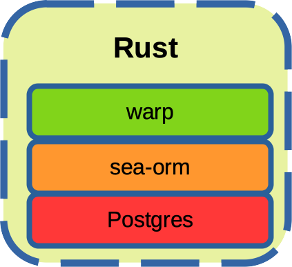

  sSSs_sSSs     .S    S.         sdSS_SSSSSSbs    sSSs    sSSs  
 d%%SP~YS%%b   .SS    SS.        YSSS~S%SSSSSP   d%%SP   d%%SP  
d%S'     `S%b  S%S    S%S             S%S       d%S'    d%S'    
S%S       S%S  S%S    S%S             S%S       S%S     S%|     
S&S       S&S  S%S SSSS%S             S&S       S&S     S&S     
S&S       S&S  S&S  SSS&S             S&S       S&S     Y&Ss    
S&S       S&S  S&S    S&S             S&S       S&S     `S&&S   
S&S       S&S  S&S    S&S             S&S       S&S       `S*S  
S*b       d*S  S*S    S*S             S*S       S*b        l*S  
S*S.     .S*S  S*S    S*S             S*S       S*S.      .S*P  
 SSSbs_sdSSS   S*S    S*S             S*S        SSSbs  sSS*S   
  YSSP~YSSY    SSS    S*S             S*S         YSSP  YSS'    
                      SP              SP                        
                      Y               Y                         
                                                                

# POC | Open Hospital - Telemetry Collector Server (Rust)
See also [oh_telemetry_collector_server_java](https://github.com/goto-eof/oh_telemetry_collector_server_java) (has the same features, but it was developed in Java) and [oh_telemetry_collector_test_load](https://github.com/goto-eof/oh_telemetry_collector_load_test).

[Here](https://openhospital.atlassian.net/browse/OP-952) is the Jira ticket.

<p align="center" width="100%">
     
</p>
 
### Run 

```bash
docker-compose up
```

### Use postman collection for making requests

Import postman.json

### The server responds on

```
http://localhost:8013/telemetry:8013
```


### DB connection

```
postgres://127.0.0.1:5432/postgres
username: postgres
password: postgres
```
